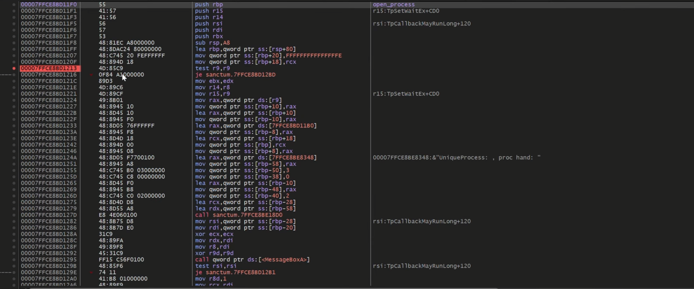
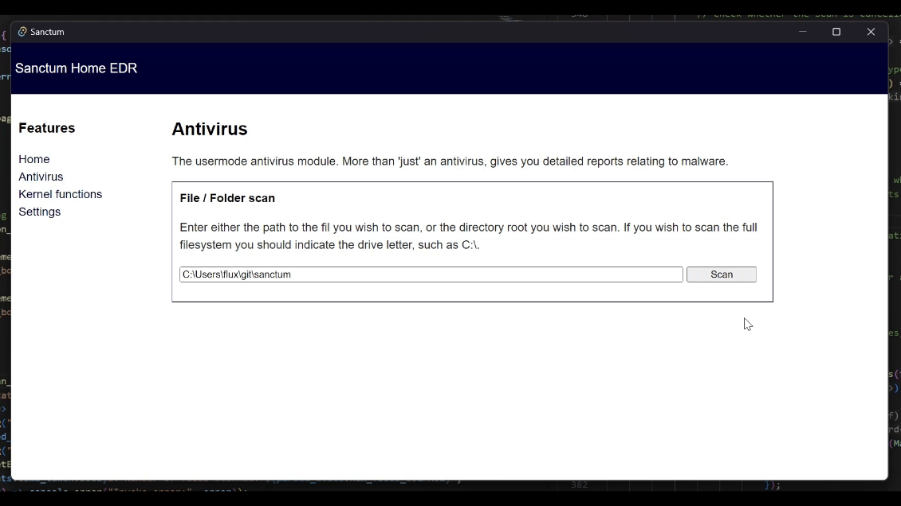
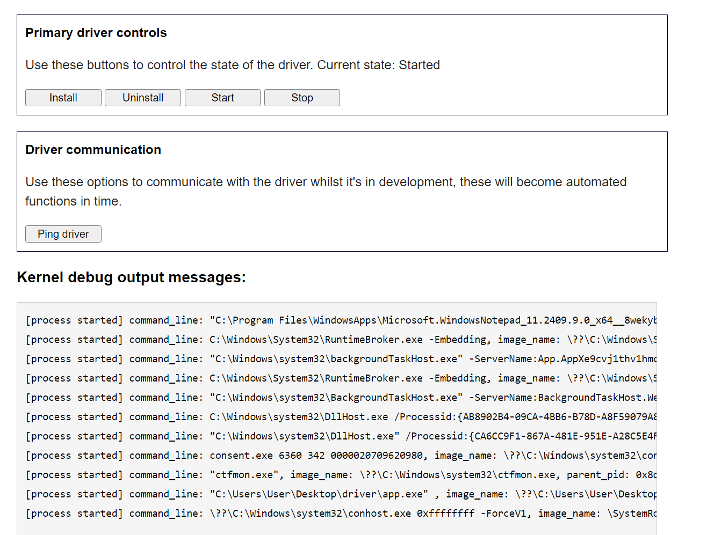

# Sanctum EDR

This project is a Windows Driver written in Rust.

Sanctum EDR is an Endpoint Detection and Response proof-of-concept product I am building, that I will use to try combat modern malware techniques that I develop.

I have started a blog series on Sanctum, you can check it out [on my blog here](https://fluxsec.red/sanctum-edr-intro). I'm keeping track of the progress and milestones of the project there, so please check that out!

Currently in its early stages, I have a plan for the project which I will update in due course. If you like this project, or my work, please feel free to reach out!

### Project plan

This is a high level overview for how I would like to structure this project.

A high level view of my API design for the internal application (not counting any web API's) looks as below. I have opted to try keep the interface UmEngine a singleton. The design is somewhat problematic in that if the UmEngine were to be mutable, a mutex would be required to mutate any internal state. The difficulty with this is that this could significantly block the main thread depending on what the mutation / action is. So I am opting at the moment for a non-publicly mutable singleton which maintains it's own state internally, allowing actions to be carried across either OS threads or green threads. The API overview (this may not be up-to-date in terms of exported functions etc):

### Why Rust for writing a Windows Driver

I started writing this driver in C, but having stepped away from C for some time, i missed a lot of Rust's features.

Rust is suited to operate in embedded and kernel environments through [libcore no_std](https://doc.rust-lang.org/core/), and with Microsoft's support for developing drivers in Rust, Rust comes up as an excellent candidate for a "safer" approach to driver development. I use "safer" in quotes because, despite Rust's safety guarantees, we still need to interact with unsafe APIs within the OS.

## Repo

The EDR code is logically separated in one solution into the kernel mode driver (the driver folder [found here](https://github.com/0xflux/sanctum/tree/master/driver)), the usermode engine ([found here](https://github.com/0xflux/sanctum/tree/master/um_engine)), and usermode DLL (todo).

# Usermode features

The usermode aspect of this application includes a GUI for you to use as a native windows program. 

## Process monitoring 

The EDR can monitor processes, tracking for signs of malicious activity in live time - currently the only supported tracking feature is 
opening remote processes,

## EDR DLL injection

The EDR `um_engine` will inject a DLL into processes for internal  monitoring of the process.

## EDR DLL syscall hooking

The EDR injected DLL hooks syscalls; currently only `ZwOpenProcess` and redirects control to a function contained within the DLL for inspection.
Via IPC, the DLL sends a message to the engine notifying it of the event, which then leads to my [Ghost Hunting](https://fluxsec.red/edr-syscall-hooking) 
technique. 

Example of hooked syscall:

And the function to which execution jumps in the DLL:

Here's two videos on syscall hooking from this project:

## Antivirus scanning for malware detection (IOC hash):

Scanning a file:

Scanning a folder:

# Driver features

## Callback monitoring

The driver monitors the creation of new processes, termination of processes, and process handles requested by applications. The driver will then
send this data back up to the usermode application (`um_engine`) via IOCTL.

## Basic IOCTL

The driver can be communicated with both via IOCTLs and named pipes, here is an example of data being sent from the driver back up to user land:

Driver checks compatibility with the client version and will panic (usermode) and unload the driver if the versions are not compatible.

# Additional info

## Installation

### Requirements:

1) Cargo (obviously..)
2) Nightly
3) For ELAM: From the developer command prompt:
   1) `cargo make`
   2) `sign.bat` (This is important to sign the driver with the **custom** self signed cert for ETW access)
   3) In the root sanctum, sign_elam.bat needs running to sign the elam runner binary with the **same** cert that signed the driver.
4) Windows Driver Kit & Developer Console (as admin for building the driver)
5) May wish to add a symlnk for .vscode/settings.json in the driver to that in the root for spelling etc.

## Helpful notes:

1) To see driver install config, regedit: HKEY_LOCAL_MACHINE\SYSTEM\CurrentControlSet\Services\Sanctum.
2) The app will create a location in %AppData% where the IOC file and settings are created. You will also need to drop the built driver into this location. A built driver is not shipped with this repo, so it must be built after cloned with cargo make from the driver directory.
3) To use ETW:TI you must use a self signed cert with specific params. If this cert changes, need to recalculate the hash of it and apply it to the .rc hash field, get this from `To-Be-Signed Hash` from `ertmgr.exe -v target/debug/sanctum_package/sanctum.sys`.