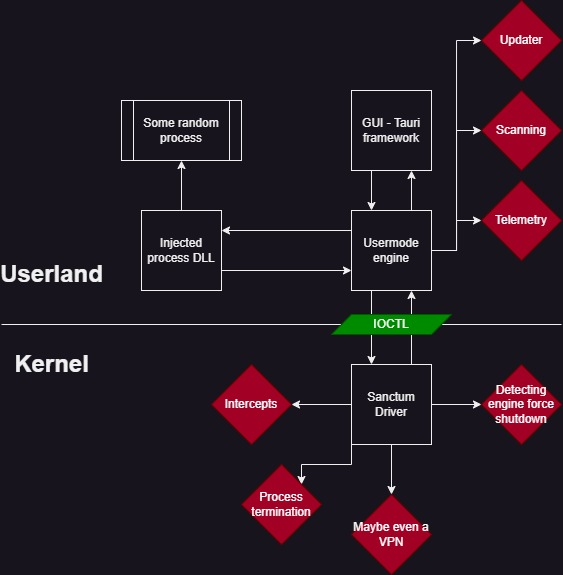

# Sanctum EDR

This project is a Windows Driver written in Rust.

Sanctum EDR is an Endpoint Detection and Response proof-of-concept product I am building, that I will use to try combat modern malware techniques that I develop.

I have started a blog series on Sanctum, you can check it out [on my blog here](https://fluxsec.red/sanctum-edr-intro). I'm keeping track of the progress and milestones of the project there, so please check that out!

Currently in its early stages, I have a plan for the project which I will update in due course. If you like this project, or my work, please feel free to reach out!

### Project plan

This is a high level overview for how I would like to structure this project.

A high level view of my API design for the internal application (not counting any web API's) looks as below. I have opted to try keep the interface UmEngine a singleton. The design is somewhat problematic in that if the UmEngine were to be mutable, a mutex would be required to mutate any internal state. The difficulty with this is that this could significantly block the main thread depending on what the mutation / action is. So I am opting at the moment for a non-publicly mutable singleton which maintains it's own state internally, allowing actions to be carried across either OS threads or green threads. The API overview (this may not be up-to-date in terms of exported functions etc):

### Why Rust for writing a Windows Driver

Traditionally, drivers have been written in C and, to some extent, C++. While it might seem significantly easier to write this project in C—I even began it that way—as an avid Rust enthusiast, I found myself longing for Rust's features and safety guarantees. Writing in C or C++ made me miss the modern tooling and expressive power that Rust provides.

Thanks to Rust's ability to operate in embedded and kernel development environments through [libcore no_std](https://doc.rust-lang.org/core/), and with Microsoft's support for developing drivers in Rust, Rust comes up as an excellent candidate for a "safer" approach to driver development. I use "safer" in quotes because, despite Rust's safety guarantees, we still need to interact with unsafe APIs within the operating system. However, Rust's stringent compile-time checks and ownership model significantly reduce the likelihood of common programming errors & vulnerabilities.

The Windows Driver Kit (WDK) crate ecosystem provides essential tools that make driver development in Rust more accessible. With these crates, we can easily manage heap memory and utilize familiar Rust idioms like println!(). The maintainers of these crates have done a fantastic job bridging the gap between Rust and Windows kernel development.

## Repo

The EDR code is logically separated in one solution into the kernel mode driver (the driver folder [found here](https://github.com/0xflux/sanctum/tree/master/driver)), the usermode engine ([found here](https://github.com/0xflux/sanctum/tree/master/um_engine)), and usermode DLL (todo).

# Usermode features

The usermode aspect of this application includes a GUI for you to use as a native windows program. 

## Antivirus scanning for malware detection (IOC hash):

Scanning a file:

Scanning a folder:

# Driver features

## Basic IOCTL

The driver implements a basic IOCTL message passing from userland to the kernel driver, and responds with a response back up to userland. A basic example of this:

You can also pass structs via IOCTL as evidenced:

Driver checks compatibility with the client version and will panic (usermode) and unload the driver if the versions are not compatible.

# Additional info

## Installation

### Requirements:

1) Cargo (obviously..)
2) Nightly
3) cargo make
4) Windows Driver Kit & Developer Console (as admin for building the driver)
5) May wish to add a symlnk for .vscode/settings.json in the driver to that in the root for spelling etc.

## Helpful notes:

1) To see driver install config, regedit: HKEY_LOCAL_MACHINE\SYSTEM\CurrentControlSet\Services\Sanctum.
2) If you are going to run this, the two paths will need editing in order for it to work (or for ease add a symlink for flux=your user):
   1) Symlink option (in an elevated terminal): `New-Item -ItemType SymbolicLink -Path "C:\Users\flux" -Target "$Env:UserProfile"`
   2) Non-symlink option:
      1) pub static SANC_SYS_FILE_LOCATION: &str = "C:\\Users\\flux\\AppData\\Roaming\\Sanctum\\sanctum.sys";
      2) pub static IOC_LIST_LOCATION: &str = "C:\\Users\\flux\\git\\sanctum\\ioc_list.txt";